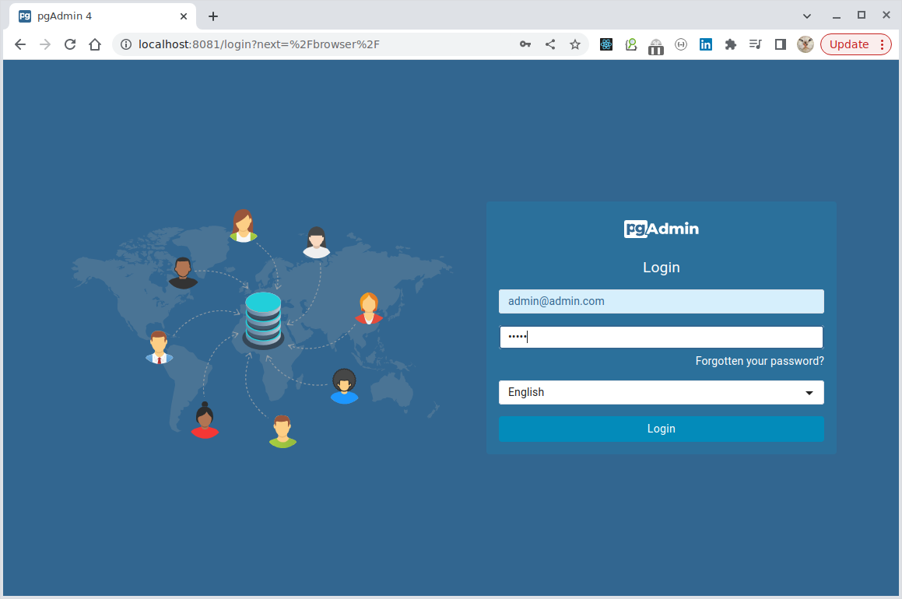
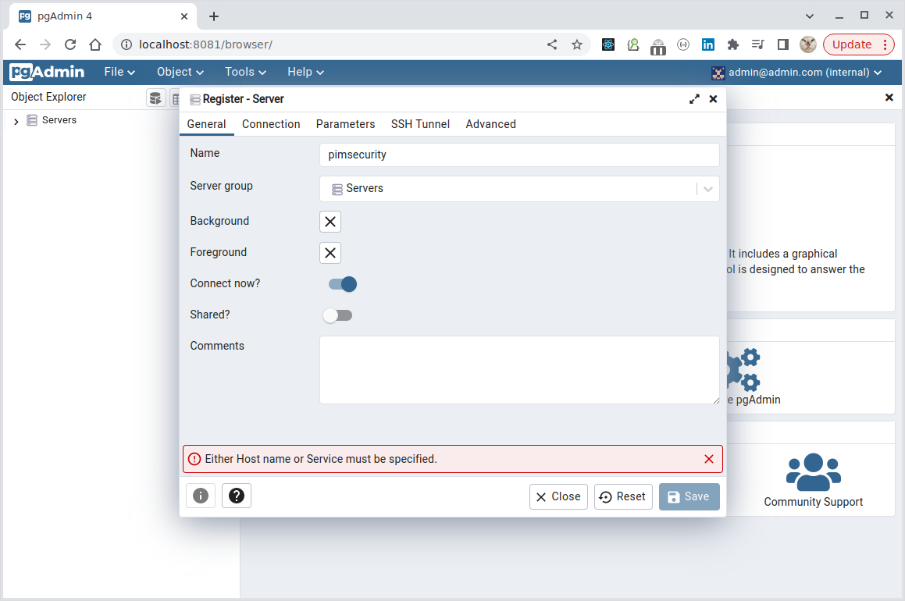
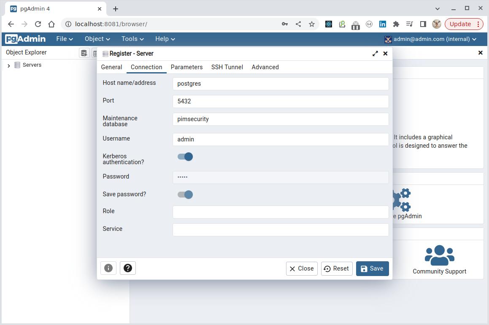
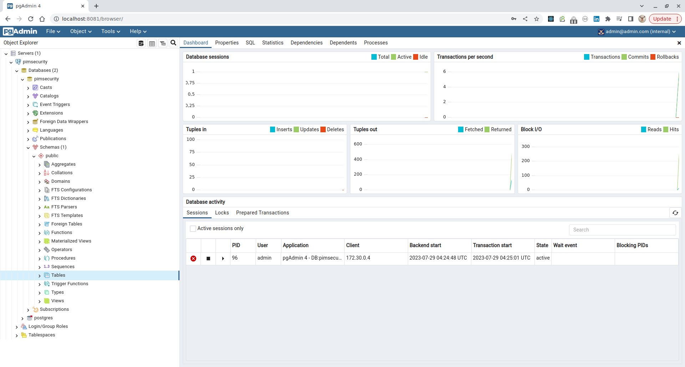

## PIM Spring Security ACL DEMO

### 1. Start

Use "Docker Compose":

````yaml
$ docker-compose up -d
  [ + ] Running 4/4
  ✔ Network rights_ss_demo_default  Created    0.1s
  ✔ Container docker-hoster         Started    0.7s
  ✔ Container postgres              Healthy   31.4s
  ✔ Container pgadmin               Started
````

As a result, we will have three docker-containers up:

- docker-hoster;
- postgres;
- pg-admin.

### 2. Connect to database by PG Admin (not neccessary, only for demonstration purposes)









### 3. Security roles

The next roles:

- ROLE_ADMIN ("admin/admin"): any operations allowed;
- ROLE_USER ("user/user"): deletion denied;
- ROLE_READER ("reader/reader"): deletion denied.

### 4. Access points

- GET `localhost:8080` - home page (to see currently authorized user);
- POST `localhost:8080/login?username=admin&password=admin` - to login as `admin` user;
- POST `localhost:8080/login?username=user&password=user` - to login as `user` user;
- POST `localhost:8080/login?username=reader&password=reader` - to login as `reader` user;
- POST `localhost:8080/logout` - to logout;
- POST `localhost:8080/items` - to get list of all items;
- PUT `localhost:8080/items?action=add-item` - to save a new item (along with its permission for current user).

**To create an item a JSON request body needed!**

````bash
{
  "title": "New item (admin)"
}
````

- POST `localhost:8080/items/1` - to get item by specified ID (here `id=1`);
- POST `localhost:8080/acl?action=add-permission&username=reader&itemid=1` - to add `READ` permission for specified
user on specified item (here we allow user `reader` to read item `id=1`);
- POST `localhost:8080/acl?action=revoke-permission&username=reader&itemid=1` - to revoke `READ` permission for
specified user on specified item (here we deny user `reader` to read item `id=1`);

### 4. How to use

1. Login as `admin` and create some items. Assign permission on them for users `reader` or `user`;
2. Logout from `admin` and login as users `reader` or `user` and try to get information about all items in the system
and items retrieved by `id`;
3. Logout and login as `admin` and revoke some permissions;
4. Logout and login as users `reader` or `user` to see the items again.

---
